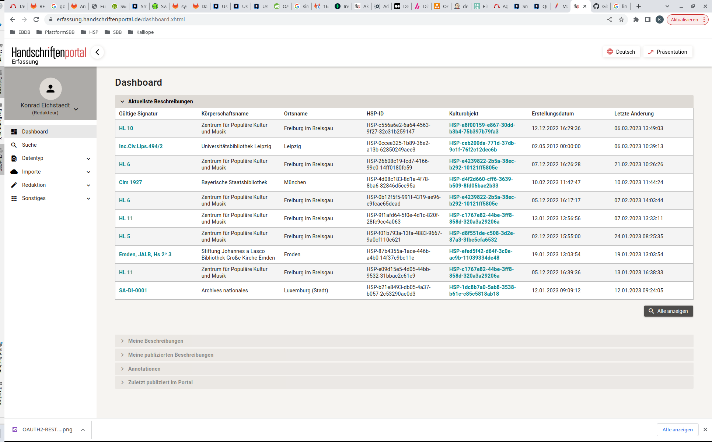

# Handschriftenportal - Editing Manuscript Descriptions -

**Description**:  This software is the main data management system of the whole manuscript description system. 
The main aim of the software is to offer a recording and data management possibility for manuscript editors. The editors
can using this software to import data as XML files, registrating new manuscripts and editor all descriptions. 

- **Technology stack**:  The implementation is based on the Java Enterprise Standard. This Standard is now maintained by Eclipse Foundation. 
The runtime Environment is [Quarkus](https://quarkus.io/) Server. The build Tool is [Maven](https://maven.apache.org/) and the project is an multi-module project. 

- **Status**:  Beta (in development)
- **Links:** [Production instance](https://erfassung.handschriftenportal.de/)
- Describe what sets this apart from related-projects. Linking to another doc or page is OK if this can't be expressed
  in a sentence or two.

## Getting started

1. Get the source code

   ```
   git clone https://github.com/handschriftenportal-dev/nachweis-service
   ```

2. Start the server

   ```java
   cd hsp-nachweis
   mvn clean compile quarkus:dev -Dquarkus.profile=testsystem -DskipTests -Dquarkus.devservices.enabled=false -U
   ```

3. Open the editor within the browser

   ```
   http://localhost:9298/erfassung.xhtml
   ```
After a successful start the following screen should appear. 



For full functionality several other microservices are needed. Therefore it makes less sense to start it locally without any other microservice. 
Only for development reasons it makes sense to start the server to check dedicated functions under development. In case that the complete 
functionality is needed we are working currently for a container based solution. 

## Configuration

The configuration of the nachweis is based on properties files which are located in resources folder.

## Usage

## How to test the software

1. To run all unit tests please use the following command

```
mvn clean test -Pintegration
```

## Known issues

## Getting help

To get help please use our contact possibilities on [twitter](https://twitter.com/hsprtl)
and [handschriftenportal.de](https://handschriftenportal.de/)

## Getting involved

To get involed please contact our develoment
team [handschriftenportal@sbb.spk-berlin.de](handschriftenportal-dev@sbb.spk-berlin.de)

## Open source licensing info

The project is published under the [MIT License](https://opensource.org/licenses/MIT).

## Credits and references

1. [Github Project Repository](https://github.com/handschriftenportal-dev)
2. [Project Page](https://handschriftenportal.de/)
3. [Internal Documentation](doc/ARC42.md)

## RELEASE Notes
